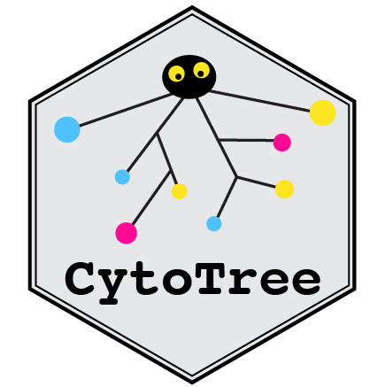
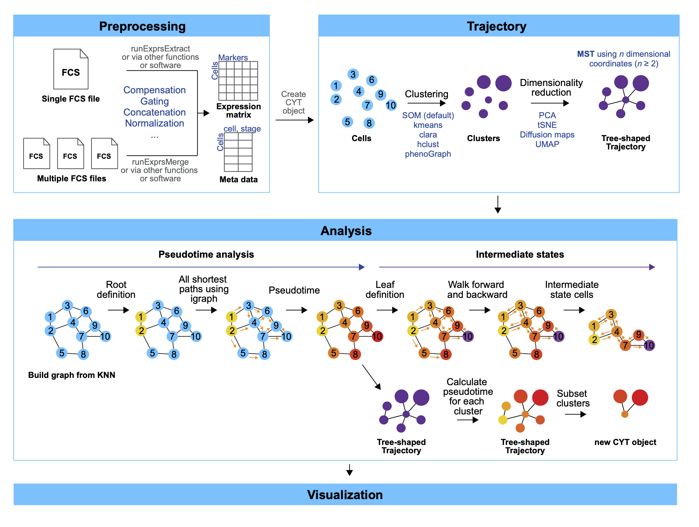

```{r echo = TRUE}
knitr::opts_chunk$set(echo = TRUE, cache = FALSE, eval = TRUE,
                      warning = TRUE, message = TRUE)
```

## Link to the tutorial

See the quick start tutorial of flowSpy, please visit [Quick start of flowSpy](https://ytdai.github.io/flowSpy/Quick_start.html).

See the basic tutorial of flowSpy, please visit [Tutorial of flowSpy](https://ytdai.github.io/flowSpy/basic.html).

See time-course data analysis of flowSpy, please visit [Time-course workflow of flowSpy](https://ytdai.github.io/flowSpy/Time_course.html).


## Introduction

Although multidimensional single-cell-based flow and mass cytometry have been increasingly applied to microenvironmental composition and stem-cell research, integrated analysis workflows to facilitate the interpretation of experimental cytometry data remain underdeveloped. We present flowSpy, a comprehensive R package designed for the analysis and interpretation of flow and mass cytometry data. We applied flowSpy to mass cytometry and time-course flow cytometry data to demonstrate the usage and practical utility of its computational modules. flowSpy is a reliable tool for multidimensional cytometry data workflows and produces compelling results for trajectory construction and pseudotime estimation. 



## Overview of flowSpy workflow

The flowSpy package is developed to complete the majority of standard analysis and visualization workflow for FCS data. In flowSpy workflow, an S4 object in R is built to implement the statistical and computational approach, and all computational modules are integrated into one single channel which only requires a specified input data format.

`flowSpy` can help you to perform four main types of analysis:

- **Clustering**. `flowSpy` can help you to discover and identify subtypes of cells. 

- **Dimensionality Reduction**. Several dimensionality reduction methods are provided in `flowSpy` package such as Principal Components Analysis (PCA), t-distributed Stochastic Neighbor Embedding (tSNE), Diffusion Maps and Uniform Manifold Approximation and Projection (UMAP). flowSpy provides both cell-based and cluster-based dimensionality reduction.

- **Trajectory Inference**. `flowSpy` can help you to construct the cellular differential based on minimum spanning tree (MST) algorithm. 

- **Pseudotime and Intermediate states definition**. The root cells need to be defined by users. The trajctroy value will be calculated based on Shortest Path from root cells and leaf cells using R `igraph` package. Subset FCS data set in `flowSpy` and find the key intermediate cell states based on trajectory value.


<center>  </center>

<center> **Fig. 1  Workflow of flowSpy** </center>

## References


1. Hahne F, Arlt D, Sauermann M, Majety M, Poustka A, Wiemann S, Huber W: Statistical methods and software for the analysis of highthroughput reverse genetic assays using flow cytometry readouts. Genome Biol 2006, 7:R77.
2. Olsen LR, Leipold MD, Pedersen CB, Maecker HT: The anatomy of single cell mass cytometry data. Cytometry A 2019, 95:156-172.
3. Butler A, Hoffman P, Smibert P, Papalexi E, Satija R: Integrating single-cell transcriptomic data across different conditions, technologies, and species. Nat Biotechnol 2018, 36:411-420.
4. Trapnell C, Cacchiarelli D, Grimsby J, Pokharel P, Li S, Morse M, Lennon NJ, Livak KJ, Mikkelsen TS, Rinn JL: The dynamics and regulators of cell fate decisions are revealed by pseudotemporal ordering of single cells. Nat Biotechnol 2014, 32:381-386.
5. Kiselev VY, Yiu A, Hemberg M: scmap: projection of single-cell RNA-seq data across data sets. Nat Methods 2018, 15:359-362.
6. Amir el AD, Davis KL, Tadmor MD, Simonds EF, Levine JH, Bendall SC, Shenfeld DK, Krishnaswamy S, Nolan GP, Pe'er D: viSNE enables visualization of high dimensional single-cell data and reveals phenotypic heterogeneity of leukemia. Nat Biotechnol 2013, 31:545-552.
7. Haghverdi L, Buettner F, Theis FJ: Diffusion maps for high-dimensional single-cell analysis of differentiation data. Bioinformatics 2015, 31:2989-2998.
8. Becht E, McInnes L, Healy J, Dutertre CA, Kwok IWH, Ng LG, Ginhoux F, Newell EW: Dimensionality reduction for visualizing single-cell data using UMAP. Nat Biotechnol 2018.
9. Wang L, Hoffman RA: Standardization, Calibration, and Control in Flow Cytometry. Curr Protoc Cytom 2017, 79:1 3 1-1 3 27.
10. Hahne F, LeMeur N, Brinkman RR, Ellis B, Haaland P, Sarkar D, Spidlen J, Strain E, Gentleman R: flowCore: a Bioconductor package for high throughput flow cytometry. BMC Bioinformatics 2009, 10:106.
11. Sarkar D, Le Meur N, Gentleman R: Using flowViz to visualize flow cytometry data. Bioinformatics 2008, 24:878-879.
12. Van Gassen S, Callebaut B, Van Helden MJ, Lambrecht BN, Demeester P, Dhaene T, Saeys Y: FlowSOM: Using self-organizing maps for visualization and interpretation of cytometry data. Cytometry A 2015, 87:636-645.
13. Qiu P, Simonds EF, Bendall SC, Gibbs KD, Jr., Bruggner RV, Linderman MD, Sachs K, Nolan GP, Plevritis SK: Extracting a cellular hierarchy from high-dimensional cytometry data with SPADE. Nat Biotechnol 2011, 29:886-891.
14. Chen H, Lau MC, Wong MT, Newell EW, Poidinger M, Chen J: Cytofkit: A Bioconductor Package for an Integrated Mass Cytometry Data Analysis Pipeline. PLoS Comput Biol 2016, 12:e1005112.
15. Chattopadhyay PK, Winters AF, Lomas WE, 3rd, Laino AS, Woods DM: High-Parameter Single-Cell Analysis. Annu Rev Anal Chem (Palo Alto Calif) 2019, 12:411-430.
16. Bendall SC, Davis KL, Amir el AD, Tadmor MD, Simonds EF, Chen TJ, Shenfeld DK, Nolan GP, Pe'er D: Single-cell trajectory detection uncovers progression and regulatory coordination in human B cell development. Cell 2014, 157:714-725.
17. Nowicka M, Krieg C, Crowell HL, Weber LM, Hartmann FJ, Guglietta S, Becher B, Levesque MP, Robinson MD: CyTOF workflow: differential discovery in high-throughput high-dimensional cytometry datasets. F1000Res 2017, 6:748.


